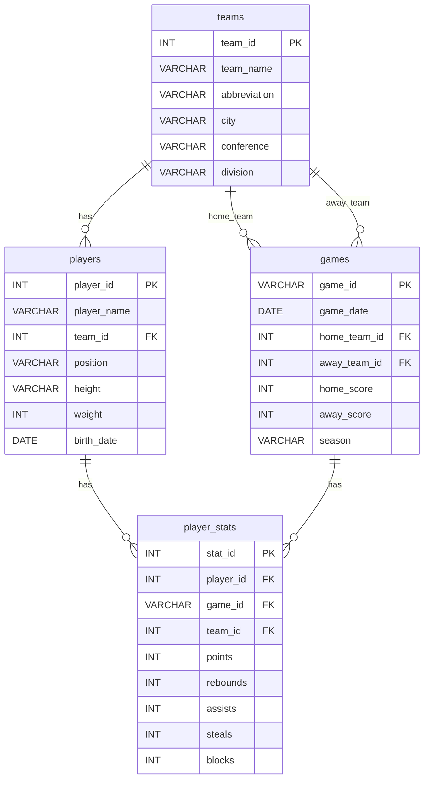

# Final Project - NBA Database System

## 1. Introduction

本專案是一個 NBA 籃球數據管理系統，使用 Flask 網頁框架搭配 MySQL 資料庫建置。系統透過 nba_api 取得 NBA 官方數據，包含球隊資訊、球員資料、比賽結果與球員表現統計。使用者可以透過網頁介面進行資料的新增、修改、刪除與查詢 (CRUD)，也可以使用進階功能如球員比較、數據排行榜、球隊戰績排名、對戰紀錄查詢等。本系統適合籃球愛好者、球隊管理人員或數據分析師使用。

---

## 2. Design Motivation

### What is the problem your system trying to address?

NBA 官方網站 (nba.com) 的數據雖然完整，但介面複雜且難以快速搜尋特定資訊。使用者如果想查詢某位球員的平均數據、比較兩位球員的表現、或是查看兩隊的對戰紀錄，往往需要在多個頁面之間切換，非常不方便。

### Why your system is suitable in addressing the problem?

我們的系統提供簡潔的網頁介面，整合了球員、球隊、比賽等資料。使用者可以透過搜尋、篩選、排序等功能快速找到需要的資訊。系統也提供球員比較、數據排行等進階功能，讓使用者可以一目了然地分析數據。

### Why does this application need a database?

1. 資料量龐大：NBA 有 30 支球隊、數百名球員、每季上千場比賽
2. 資料有關聯性：球員屬於球隊、比賽有主客場球隊、每場比賽有多筆球員數據
3. 需要複雜查詢：計算平均數據、排名、勝負場次等需要 SQL 的 aggregate functions
4. 資料需要持久化儲存：方便日後查詢歷史資料

---

## 3. Database Design

### 3.1 Schema Description

#### Table: teams
| Column | Type | Constraints | Description |
|--------|------|-------------|-------------|
| team_id | INT | PRIMARY KEY | NBA 官方球隊 ID |
| team_name | VARCHAR(100) | NOT NULL | 球隊全名 |
| abbreviation | VARCHAR(10) | | 縮寫 (如 LAL, GSW) |
| city | VARCHAR(50) | | 所在城市 |
| conference | VARCHAR(10) | | 東區/西區 |
| division | VARCHAR(30) | | 分區 |

#### Table: players
| Column | Type | Constraints | Description |
|--------|------|-------------|-------------|
| player_id | INT | PRIMARY KEY | NBA 官方球員 ID |
| player_name | VARCHAR(100) | NOT NULL | 球員姓名 |
| team_id | INT | FOREIGN KEY | 所屬球隊 |
| position | VARCHAR(20) | | 位置 (G, F, C) |
| height | VARCHAR(10) | | 身高 |
| weight | INT | | 體重 |
| birth_date | DATE | | 生日 |

#### Table: games
| Column | Type | Constraints | Description |
|--------|------|-------------|-------------|
| game_id | VARCHAR(20) | PRIMARY KEY | NBA 官方比賽 ID |
| game_date | DATE | NOT NULL | 比賽日期 |
| home_team_id | INT | FOREIGN KEY | 主場球隊 |
| away_team_id | INT | FOREIGN KEY | 客場球隊 |
| home_score | INT | | 主場得分 |
| away_score | INT | | 客場得分 |
| season | VARCHAR(10) | | 賽季 (如 2025-26) |

#### Table: player_stats
| Column | Type | Constraints | Description |
|--------|------|-------------|-------------|
| stat_id | INT | PRIMARY KEY, AUTO_INCREMENT | 自動產生的 ID |
| player_id | INT | FOREIGN KEY, NOT NULL | 球員 ID |
| game_id | VARCHAR(20) | FOREIGN KEY, NOT NULL | 比賽 ID |
| team_id | INT | FOREIGN KEY | 該場比賽所屬球隊 |
| points | INT | DEFAULT 0 | 得分 |
| rebounds | INT | DEFAULT 0 | 籃板 |
| assists | INT | DEFAULT 0 | 助攻 |
| steals | INT | DEFAULT 0 | 抄截 |
| blocks | INT | DEFAULT 0 | 阻攻 |

### 3.2 ER Diagram



### 3.3 Final Database Schema

```sql
CREATE TABLE teams (
    team_id INT PRIMARY KEY,
    team_name VARCHAR(100) NOT NULL,
    abbreviation VARCHAR(10),
    city VARCHAR(50),
    conference VARCHAR(10),
    division VARCHAR(30)
);

CREATE TABLE players (
    player_id INT PRIMARY KEY,
    player_name VARCHAR(100) NOT NULL,
    team_id INT,
    position VARCHAR(20),
    height VARCHAR(10),
    weight INT,
    birth_date DATE,
    FOREIGN KEY (team_id) REFERENCES teams(team_id) ON DELETE SET NULL
);

CREATE TABLE games (
    game_id VARCHAR(20) PRIMARY KEY,
    game_date DATE NOT NULL,
    home_team_id INT,
    away_team_id INT,
    home_score INT,
    away_score INT,
    season VARCHAR(10),
    FOREIGN KEY (home_team_id) REFERENCES teams(team_id),
    FOREIGN KEY (away_team_id) REFERENCES teams(team_id)
);

CREATE TABLE player_stats (
    stat_id INT AUTO_INCREMENT PRIMARY KEY,
    player_id INT NOT NULL,
    game_id VARCHAR(20) NOT NULL,
    team_id INT,
    points INT DEFAULT 0,
    rebounds INT DEFAULT 0,
    assists INT DEFAULT 0,
    steals INT DEFAULT 0,
    blocks INT DEFAULT 0,
    FOREIGN KEY (player_id) REFERENCES players(player_id) ON DELETE CASCADE,
    FOREIGN KEY (game_id) REFERENCES games(game_id) ON DELETE CASCADE,
    FOREIGN KEY (team_id) REFERENCES teams(team_id) ON DELETE SET NULL
);
```

### 3.4 Schema Changes from Milestone 2

**Table:** teams
**Change Type:** Modified
**Specific Change:** 新增 conference 和 division 欄位
**Rationale:** 原本只有球隊基本資料，但為了實作戰績排行功能需要區分東西區，所以新增了這兩個欄位。

**Table:** games
**Change Type:** Modified
**Specific Change:** game_id 從 INT 改成 VARCHAR(20)
**Rationale:** NBA API 回傳的 game_id 是字串格式 (如 "0022400001")，為了維持資料一致性所以改用 VARCHAR。

**Table:** player_stats
**Change Type:** Modified
**Specific Change:** 新增 team_id 欄位、新增 ON DELETE CASCADE
**Rationale:** 原本刪除球員或比賽時會因為 FK constraint 而失敗，加上 CASCADE 後可以自動刪除相關的統計資料。新增 team_id 是因為 Box Score 需要顯示球員在該場比賽屬於哪隊（球員可能季中被交易換隊）。

### 3.5 Keys and Indexes Explanation

**Primary Keys:**
- teams.team_id, players.player_id, games.game_id：使用 NBA 官方 ID 作為 PK，這樣可以避免重複匯入相同資料
- player_stats.stat_id：使用 AUTO_INCREMENT，因為一個球員在一場比賽只會有一筆數據，但 API 沒有提供統一的 stat_id

**Foreign Keys:**
- players.team_id → teams.team_id (ON DELETE SET NULL)：球隊被刪除時，球員不會被刪除，只是變成無隊
- games.home_team_id, away_team_id → teams.team_id：確保比賽的球隊都存在
- player_stats.player_id, game_id (ON DELETE CASCADE)：球員或比賽被刪除時，相關統計也一併刪除

**Indexes:**
目前沒有額外建立 index。雖然在 player_stats 的 player_id 和 game_id 加上 index 可能會加速 JOIN 查詢，但因為資料量不大 (幾千筆)，目前查詢速度已經夠快，所以暫時沒有需要。如果未來資料量變大，可以考慮加上。

### 3.6 Bonus: Is your database in BCNF?

我們的資料庫設計符合 BCNF。分析如下：

**teams 表：** 只有 team_id → 其他所有欄位 的 functional dependency，team_id 是 superkey，符合 BCNF。

**players 表：** player_id → 其他所有欄位，player_id 是 superkey，符合 BCNF。雖然 team_id 可以推導出 team_name，但 team_name 不在 players 表中，所以沒有 transitive dependency。

**games 表：** game_id → 其他所有欄位，符合 BCNF。

**player_stats 表：** stat_id → 其他所有欄位。雖然 (player_id, game_id) 也可以當作 candidate key，但我們選擇用 stat_id 作為 PK，這樣 INSERT 比較方便。

如果要 denormalize，可以考慮在 player_stats 中加入 player_name 和 team_abbr，這樣查詢時就不用 JOIN。但這樣會有資料一致性問題 (球員改名或換隊時要更新多筆)，所以我們選擇維持 normalized 的設計。

---

## 4. Data Sources

### 4.1 Data Source Description

資料來源：**nba_api** (https://github.com/swar/nba_api)

這是一個非官方的 Python 套件，可以存取 NBA 官方網站 (stats.nba.com) 的資料。資料格式是 JSON，透過 API 取得後會轉成 pandas DataFrame。

使用的 API endpoints：
- `teams.get_teams()` - 取得所有 NBA 球隊
- `players.get_active_players()` - 取得現役球員名單
- `commonplayerinfo.CommonPlayerInfo()` - 取得球員詳細資料
- `leaguegamefinder.LeagueGameFinder()` - 取得比賽資料
- `playergamelog.PlayerGameLog()` - 取得球員每場比賽的數據

### 4.2 Data Sample (100+ tuples)

執行 `SELECT * FROM player_stats LIMIT 100` 的結果：


### 4.3 Challenges During Data Collection

1. **API Rate Limiting：** NBA API 有請求次數限制，一開始沒注意到這點導致程式執行到一半就被封鎖。解決方法是在每次 API 呼叫之間加入 `time.sleep(0.2)` 延遲。
2. **資料格式不一致：** 有些球員的生日欄位是空的，直接轉換會報錯。解決方法是用 try-except 處理，並將空值設為 NULL。
3. **game_id 格式問題：** API 回傳的 game_id 是字串，但我們一開始設計成 INT，導致資料無法對應。解決方法是把 schema 改成 VARCHAR。
4. **資料量太大：** 如果要抓全部球員的資料需要花超過一小時。解決方法是限制只抓取 200 名球員的資料，約需 2-3 分鐘。

---

## 5. Data Sources to Database

### 5.1 Import Method

我們寫了一個 Python 腳本 `fetch_data.py` 來自動化匯入流程：

```python
conn = mysql.connector.connect(
    host='127.0.0.1',
    user='nba_user',
    password='nba_password',
    database='nba_db'
)
cur = conn.cursor()

# 清空舊資料
cur.execute("SET FOREIGN_KEY_CHECKS = 0")
cur.execute("TRUNCATE TABLE player_stats")
cur.execute("TRUNCATE TABLE games")
cur.execute("TRUNCATE TABLE players")
cur.execute("TRUNCATE TABLE teams")
cur.execute("SET FOREIGN_KEY_CHECKS = 1")
conn.commit()

# 從 API 取得資料並 INSERT
for t in teams.get_teams():
    cur.execute(f"""
        INSERT INTO teams VALUES(...)
        ON DUPLICATE KEY UPDATE team_name=VALUES(team_name)
    """)
```

匯入流程：
1. 連接 MySQL 資料庫
2. 清空所有資料表 (TRUNCATE)
3. 呼叫 nba_api 取得球隊資料，INSERT 到 teams
4. 呼叫 nba_api 取得球員資料，INSERT 到 players
5. 呼叫 nba_api 取得比賽資料，INSERT 到 games
6. 呼叫 nba_api 取得球員統計，INSERT 到 player_stats

### 5.2 Update Strategy

我們使用 `ON DUPLICATE KEY UPDATE` 語法，這樣如果資料已存在就更新，不存在就新增。每次執行 fetch_data.py 會先 TRUNCATE 清空所有資料，然後重新抓取最新資料。

### 5.3 How does your system "CREATE" the database?

1. 開啟 MySQL Workbench，連接到 MySQL Server
2. 在 Query 視窗執行以下指令建立資料庫和使用者：
```sql
CREATE DATABASE nba_db;
CREATE USER 'nba_user'@'%' IDENTIFIED BY 'nba_password';
GRANT ALL ON nba_db.* TO 'nba_user'@'%';
USE nba_db;
```
3. 把 `schema.sql` 的內容貼到 Query 視窗執行，建立資料表
4. 執行 Python 腳本匯入資料：
```
python fetch_data.py
```

---

## 6. Application with Database

### 6.1 Target Users

| User Type | Description | System Features |
|-----------|-------------|-----------------|
| 籃球愛好者 | 想查詢球員數據、比賽結果 | 搜尋球員、查看數據排行、球員比較 |
| 球隊管理人員 | 需要管理球員資料 | CRUD 功能 (新增、修改、刪除球員) |
| 數據分析師 | 需要分析球員表現趨勢 | 數據圖表、CSV 匯出、進階篩選 |
| Fantasy 玩家 | 想比較球員價值 | 球員比較、平均數據、單場最佳 |

### 6.2 Functionalities

| Feature | Description |
|---------|-------------|
| 球員列表 | 顯示所有球員，可搜尋、篩選 |
| 球員詳情 | 顯示球員基本資料和賽季平均數據 |
| 球員 CRUD | 新增、編輯、刪除球員 |
| 球隊列表 | 顯示所有 NBA 球隊 |
| 球隊詳情 | 顯示球隊戰績和隊上球員 |
| 比賽列表 | 顯示最近比賽結果 |
| Box Score | 顯示單場比賽所有球員數據 |
| 數據排行 | 按得分/籃板/助攻排序的球員榜 |
| 戰績排行 | 東西區球隊勝負排名 |
| 球員比較 | 選擇 2 位球員比較數據，勝出項目以綠色標示 |
| 對戰紀錄 | 查詢兩隊的歷史交手結果 |
| 數據紀錄 | 單場得分/籃板/助攻 Top 5（整合於 Stats 頁面）|
| 數據圖表 | 用 Chart.js 呈現球員表現趨勢 |
| CSV 匯出 | 匯出球員和統計資料 |
| 搜尋自動完成 | 輸入時顯示球員建議 |

### 6.3 Application Screenshots

<!-- 圖片：首頁截圖 -->


<!-- 圖片：球員列表截圖 -->


<!-- 圖片：球員詳情截圖 -->


<!-- 圖片：戰績排行截圖 -->


### 6.4 SQL Queries (實際程式碼)

**球員列表查詢：**
```sql
SELECT p.*, t.team_name, t.abbreviation t_abbr
FROM players p
LEFT JOIN teams t ON p.team_id = t.team_id
ORDER BY player_name
```

**球員平均數據：**
```sql
SELECT ROUND(AVG(points),1) ppg, ROUND(AVG(rebounds),1) rpg,
       ROUND(AVG(assists),1) apg, ROUND(AVG(steals),1) spg,
       ROUND(AVG(blocks),1) bpg, COUNT(*) gp
FROM player_stats
WHERE player_id = {id}
```

**數據排行榜：**
```sql
SELECT p.player_id, p.player_name, t.abbreviation t_abbr,
       ROUND(AVG(ps.points),1) avg_val, COUNT(*) gp
FROM player_stats ps
JOIN players p ON ps.player_id = p.player_id
LEFT JOIN teams t ON p.team_id = t.team_id
GROUP BY p.player_id
ORDER BY avg_val DESC
LIMIT 20
```

**戰績排行：**
```sql
SELECT t.team_id, t.team_name, t.abbreviation, t.conference,
       (SELECT COUNT(*) FROM games
        WHERE (home_team_id=t.team_id AND home_score>away_score)
           OR (away_team_id=t.team_id AND away_score>home_score)) as wins,
       (SELECT COUNT(*) FROM games
        WHERE (home_team_id=t.team_id AND home_score<away_score)
           OR (away_team_id=t.team_id AND away_score<home_score)) as losses
FROM teams t
ORDER BY wins DESC
```

**對戰紀錄：**
```sql
SELECT g.*, h.abbreviation h_abbr, a.abbreviation a_abbr
FROM games g
LEFT JOIN teams h ON g.home_team_id = h.team_id
LEFT JOIN teams a ON g.away_team_id = a.team_id
WHERE (g.home_team_id = {t1} AND g.away_team_id = {t2})
   OR (g.home_team_id = {t2} AND g.away_team_id = {t1})
ORDER BY g.game_date DESC
```

**單場最佳得分：**
```sql
SELECT ps.points, p.player_name, p.player_id,
       t.abbreviation t_abbr, g.game_date
FROM player_stats ps
JOIN players p ON ps.player_id = p.player_id
LEFT JOIN teams t ON p.team_id = t.team_id
JOIN games g ON ps.game_id = g.game_id
ORDER BY ps.points DESC
LIMIT 10
```

**球員搜尋 API：**
```sql
SELECT player_id, player_name
FROM players
WHERE player_name LIKE '%{q}%'
LIMIT 10
```

### 6.5 Database Connection

我們使用 `mysql-connector-python` 套件連接資料庫：

```python
import mysql.connector

def query(sql):
    conn = mysql.connector.connect(
        host='127.0.0.1',
        user='nba_user',
        password='nba_password',
        database='nba_db'
    )
    cur = conn.cursor(dictionary=True)
    cur.execute(sql)
    res = cur.fetchall() if sql.strip()[0] == 'S' else conn.commit()
    cur.close()
    conn.close()
    return res
```

這個 `query()` 函數會：
1. 建立資料庫連線
2. 執行 SQL 指令
3. 如果是 SELECT 就回傳結果，否則 commit 變更
4. 關閉連線

使用 `dictionary=True` 讓回傳的每一列是 dict 而不是 tuple，這樣在 template 中可以用 `row.column_name` 存取。

---

## 7. 參考資料

### 資料庫
- MySQL 官方文件: https://dev.mysql.com/doc/
- MySQL 建立資料表語法: https://dev.mysql.com/doc/refman/8.0/en/create-table.html
- MySQL 外鍵約束: https://dev.mysql.com/doc/refman/8.0/en/create-table-foreign-keys.html
- SQL 語法大全: https://hackmd.io/@Yung-Pei/HyPV34b5c
- SQL JOIN 語法教學: https://www.w3schools.com/sql/sql_join.asp

### Python 網頁框架
- Flask 官方文件: https://flask.palletsprojects.com/
- Flask 快速入門: https://flask.palletsprojects.com/en/3.0.x/quickstart/
- Jinja2 模板引擎: https://jinja.palletsprojects.com/
- Flask 與 MySQL 連線教學: https://ithelp.ithome.com.tw/articles/10347166

### 資料庫連接
- MySQL Connector/Python 官方文件: https://dev.mysql.com/doc/connector-python/en/
- Python MySQL 操作教學: https://medium.com/jeasee%E9%9A%A8%E7%AD%86/python-mysql-acd7a9679109
- Python MySQL CRUD: https://devs.tw/post/448

### NBA 資料 API
- nba_api GitHub: https://github.com/swar/nba_api
- nba_api 使用文件: https://github.com/swar/nba_api/blob/master/docs/table_of_contents.md
- Python nba_api 教學: https://www.codegym.tech/blog/python-nba-api
- NBA 官方數據網站: https://www.nba.com/stats

### HTML/CSS
- HTML 基礎筆記: https://hackmd.io/@AndyChiang/HTMLnote
- 網頁美編由 Claude Code 協助

### 其他教學
- Flask 連接 MySQL 教學: https://www.digitalocean.com/community/tutorials/how-to-use-a-mysql-database-in-a-flask-application
- Python MySQL CRUD 操作: https://www.w3schools.com/python/python_mysql_getstarted.asp
- tqdm 教學: https://ithelp.ithome.com.tw/articles/10369273
